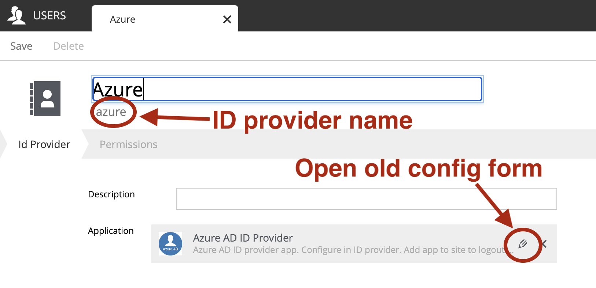

# Azure ID Provider

Authenticate your users using Azure Active Directory
This ID Provider uses the OAuth2 v2 endpoint of your Azure AD to authenticate users.

[](https://jitpack.io/#no.item/app-azure-ad-idprovider)

## Acknowledgement
- Based on [ADFS Id Provider](https://github.com/enonic/app-adfs-idprovider)
- Developed by [Øyvind Nordli](https://github.com/Garlov)

## Compatibility

| Version |    XP Version     |                                                                                                                              Download |
|---------|:-----------------:|--------------------------------------------------------------------------------------------------------------------------------------:|
| 0.1.0   |     >= 7.0.0      | [Download](https://dl.bintray.com/gravitondigital/public/com/gravitondigital/app/azureadidprovider/0.1.0/azureadidprovider-0.1.0.jar) |
| 1.0.0   |     >= 7.0.0      | [Download](https://dl.bintray.com/gravitondigital/public/com/gravitondigital/app/azureadidprovider/1.0.0/azureadidprovider-1.0.0.jar) |
| 1.1.0   |     >= 7.0.0      |                [Download](https://repo1.maven.org/maven2/com/gravitondigital/app/azureadidprovider/1.1.0/azureadidprovider-1.1.0.jar) |
| 1.2.0   |     >= 7.0.0      |                [Download](https://repo1.maven.org/maven2/com/gravitondigital/app/azureadidprovider/1.2.0/azureadidprovider-1.2.0.jar) |
| 1.2.1   |     >= 7.7.4      |                                [Download](https://jitpack.io/no/item/app-azure-ad-idprovider/1.2.1/app-azure-ad-idprovider-1.2.1.jar) |
| 1.2.2   |     >= 7.7.4      |                                [Download](https://jitpack.io/no/item/app-azure-ad-idprovider/1.2.2/app-azure-ad-idprovider-1.2.2.jar) |
| 1.2.3   |     >= 7.7.4      |                                [Download](https://jitpack.io/no/item/app-azure-ad-idprovider/1.2.3/app-azure-ad-idprovider-1.2.3.jar) |
| 1.2.4   |     >= 7.7.4      |                                [Download](https://jitpack.io/no/item/app-azure-ad-idprovider/1.2.4/app-azure-ad-idprovider-1.2.4.jar) |
| 2.0.0   |     >= 7.7.4      |                                [Download](https://jitpack.io/no/item/app-azure-ad-idprovider/2.0.0/app-azure-ad-idprovider-2.0.0.jar) |

## App Setup

### Azure Application
Go to Portal Azure, and either create an app or use an existing one.
Can be found in Azure `Active Directory` -> `App registrations` -> `New registration`

You'll then need to add the redirect URI for your enonic XP instance to your Azure application. This can be found in the `Authentication` section of your app. Add a new Web platform and then add your url there, the url will most likely look something like `https://${domain}/admin/tool/_/idprovider/${nameOfIdProvider}`. You can add multiple redirect URIs if necessary.

If you want to auto import the users AD groups in Enonic you have to add some API permissions as well:
* Directory.Read.All
* Directory.ReadWrite.All
* Directory.AccessAsUser.All

[Graph API Docs](https://docs.microsoft.com/en-us/graph/api/user-list-memberof?view=graph-rest-1.0&tabs=http)

### Enonic XP
Install the Azure ID Provider app if you haven't already.

Open up the User manage interface and add a new Id Provider. Give this Id Provider a name, and check that the path name of the Id Provider is the same as the last part of the redirect URI added to your application in Azure.

Add the Azure ID Provider to the `Application` field and press the small pencil to open up the settings.
* Tentant ID can be found in the overview page on your app in Azure as `Directory (tenant) ID`.
* Client ID can be found in the overview page on your app in Azure as `Application (client) ID`.
* Logout url is where you want to send the user if they press the logout button in XP. For Azure AD you'd most likely send them to the azure ad logout url, with your redirect url as a param. Remember to url encode the redirect url https://login.microsoftonline.com/common/oauth2/v2.0/logout?post_logout_redirect_uri=http%3A%2F%2Flocalhost%3A8080%2F or see https://docs.microsoft.com/en-us/azure/active-directory/develop/v2-protocols-oidc#send-a-sign-out-request for more info. You can also omit the post_logout_redirect_uri, and the app will try to make an educated guess, but this in not recommended.
* Client Secret has to be made in the `Certificates & secrets` section under your application in Azure.
* If you want to change the Azure AD -> Enonic XP user mapping, do so in the User Mappings (most likely not necessary).
* Remember to add the API permissions listed above if you want to create and update groups in Enonic XP based on the groups in Azure AD.
* If your Enonic XP server instance is hosted on https, you'll most likely need to check the `Force the redirect uri to use https`, since XP itself doesn't know that it is using https if it's behind a reverse proxy of some sort.

<br />
<br />

## Configuration

**As of v2.0.0, the config form in the users app (_idprovider.xml_) has been removed.** The settings to configure the id provider must instead be entered in a [.CFG file](https://developer.enonic.com/docs/xp/stable/deployment/config): _com.enonic.app.azureadidprovider.cfg_.

In this .cfg file, all ID providers that use this app are configured. Each ID provider gets a `idprovider.<idprovidername>` namespace, which prefixes the config fields. The [ID provider name](#users-app) is set in the Users app in XP. For example, setting the `pageSize` config field with a value of 10 for an ID provider named `azure`, will look like this:  `idprovider.azure.pageSize=10`.


### Overview

The following settings are available for using in **com.enonic.app.azureadidprovider.cfg**. [More details](#fields-in-the-config) follow below.

```ini
autoinit=  (true or false, optional)

idprovider.<idprovidername>.tenantId=  (string, required)
idprovider.<idprovidername>.clientId=  (string, required)
idprovider.<idprovidername>.logoutUrl=  (string, required)
idprovider.<idprovidername>.clientSecret=  (string, required)

idprovider.<idprovidername>.createAndUpdateGroupsOnLoginFromGraphApi=  (true or false, optional)
idprovider.<idprovidername>.forceHttpsOnRedirectUri=  (true or false, optional)
idprovider.<idprovidername>.pageSize=  (number, optional)

# Optional deeper namespaces: 'user', 'proxy' and 'groupFilter'.
# If used, they have more fields/array items below them, which be required or optional.

idprovider.<idprovidername>.user.name=  (string, required)
idprovider.<idprovidername>.user.displayName=  (string, required)
idprovider.<idprovidername>.user.email=  (string, required)

idprovider.<idprovidername>.proxy.host=  (string, required)
idprovider.<idprovidername>.proxy.port=  (number between 0 and 65535, optional)
idprovider.<idprovidername>.proxy.user=  (string, optional)
idprovider.<idprovidername>.proxy.password=  (string, optional)

idprovider.<idprovidername>.groupFilter.0.groupProperty=  (string, required)
idprovider.<idprovidername>.groupFilter.0.regexp=  (string, required)
idprovider.<idprovidername>.groupFilter.0.and=  (true or false, optional)

# The '0' in the 'groupFilter' namespace is syntax for the first item in an array.
# For another item, just use '1', and so on:
# idprovider.<idprovidername>.groupFilter.1.groupProperty   ...etc
```


### Fields in the config

- `autoinit`: Automatic initialization. If _com.enonic.app.azureadidprovider.cfg_ contains `autoinit=true`, then during startup this app will look all idprovider names declared in the file and create them (if the app names don't already exist) with those settings. For example, `idprovider.myfirstidp.someKey=someValue` and `idprovider.anotheridp.anotherKey=anotherValue` will declare two idproviders named `myfirstidp` and `anotheridp`.
<br />
<br />
- `...tenantId`: Tenant ID, the directory (tenant) ID found in Portal Azure
- `...clientId`: Client ID, the application (client) ID for your application in Portal Azure
- `...logoutUrl`: Logout URL, see the [OIDC protocol docs](https://docs.microsoft.com/en-us/azure/active-directory/develop/v2-protocols-oidc#send-a-sign-out-request)
- `...clientSecret`: Client Secret found in Portal Azure
<br />
<br />
- `...createAndUpdateGroupsOnLoginFromGraphApi`: Create and update groups from graph api. Create and update groups when a user is logged in based on groups returned from graph api
- `...forceHttpsOnRedirectUri`: Force the redirect uri to use https. If your enonic instance is running behind a SSL reverse proxy this might be necessary if you're not forwarding all http requests to https
- `...pageSize`: The page return size from graph api. If the result contains more than the page size, graph api will return an __@odata.nextLink__ property similar to the following along with the first page of users.
<br />
<br />
- `...user` (`idprovider.<idprovidername>.user...` namespace): User mappings. These fields provide placeholders and patterns for how Azure's user objects will be used to populate user data in XP. Note: The placeholders use a `@@` syntax in the .cfg file (in the config form in previous versions of the app, placeholders looked like `${placeholder}`. But the syntax`${}` can cause unwanted behavior in .cfg files, so the `$` is changed to `@@`). **Replace any `$` in the values with a double `@`**!
  - `...name`: Unique user name. Eg.: `@@{name}`
  - `...displayName`: Display name. Eg.: `@@{given_name} @@{family_name} &lt;@@{upn}&gt;`
  - `...email`: Email. Recommended: `@@{upn}`
<br />
<br />
- `...proxy` (`idprovider.<idprovidername>.proxy...` namespace): Proxy. Used to configure a proxy to use when talking to Azure AD:
  - `...host`: Host. Proxy host name to use.
  - `...port`: Port Number. Proxy port to use.
  - `...user`: Username for proxy authentication
  - `...password`: Password for proxy authentication
<br />
<br />
- `...groupFilter` (`idprovider.<idprovidername>.groupFilter...` namespace): Group Filter - see [details below](#group-filtering). This namespace requires **an array** immediately below it, counting from 0, with required and optional fields below each item in the array. Each array item adds a rule for filtering groups:
  - `...groupProperty`: Property on the group returned from the graph API you want to test against.
  - `...regexp`: Regexp: Regular Expression to check with
  - `...and`: AND combination rule with other items in the array


### Group Filtering
If you don't want to import all the users groups from Azure AD, it's possible to use group filters to accomplish this.

You can add multiple filters. Each filter takes 3 parameters:
`property`: This is the property that comes from the MemberOf graphApi for each group. [List of properties](https://docs.microsoft.com/en-us/graph/api/resources/group?view=graph-rest-1.0#properties)
`regexp`: Which Regular Expression to run on the property
`and`: If you want to AND this with the previous filter.

Example:
`property`: description
`regexp`: \\\$XP\\\$
`and`: false

`property`: displayName
`regexp`: ^XP
`and`: false

`property`: id
`regexp`: 12345-12345-12345-12345
`and`: false

`property`: visibility
`regexp`: Public
`and`: true

This will then include groups with descriptions marked with `$XP$`, or groups with a display name starting with `XP`, or the group with id `12345-12345-12345-12345  ` where visibility is `Public`. So it's divided into 3 checks: 1 OR 2 OR (3 AND 4)

<br />
<br />

## Upgrading from version 1.x

Version 2.x of this app introduces two breaking changes:
- As detailed above, [all configuration now happens in com.enonic.app.azureadidprovider.cfg](#configuration) instead of editing a form in the Users app. So no configuration will be stored in / read from the data layer anymore.
- The app name and key has changed. After Enonic formally took over this project, the app key is now `com.enonic.app.azureadidprovider` (previously __com.gravitondigital.app.azureadidprovider__), and for clarity, the displayName of the app has shortened to __Azure ID provider__ (removing "AD" from the previous __Azure AD ID provider__). Also, the logo has been updated to clarify the difference:


The following upgrade descriptions use information you can find by editing your 1.x ID provider app in XP:



### 1. Migrate the configuration

Create _com.enonic.app.azureadidprovider.cfg_ in your /config folder. Then in XP, enter the Users app and edit the ID provider. Note the ID provider name (without the leading slash), and click the edit-form icon to view the configuration entered in the old app. Transfer the values into the .cfg file, [the way it's specified above](#configuration)

(The order of the fields in the form is slightly different from [the description above](#fields-in-the-config))

### 2. Change the app

__After__ migrating the configuration as above, a few more steps are needed:
- Open the Application manager in XP. The app cannot simply be version-upgraded here (because of the app key change). First, install the new version of the app: _Azure ID provider_. Don't uninstall the old one yet.
- Existing ID provider(s) must be re-pointed to the new app instead of the old. Edit it (/them) in the Users app: under Applications, select the new __Azure IP provider__ and remove the old __Azure AD ID provider__. Save and close.
- Any added customization (hardcoded references etc) in your apps/environments that refers to the old app key `com.gravitondigital.app.azureadidprovider` must be updated to `com.enonic.app.azureadidprovider`.
- Finally, back in the Application manager in XP, the old app __Azure **AD** ID provider__ can be uninstalled.

#################################################################


The config keys in the .cfg file are the same as they were in the form, but uses dot-separation to place them below `idprovider.<idprovidername>.*`. The `*` corresponds to the input names (`<input name="*" ...>` previously found in the form.

The structure from the form/data layer should be mirrored exactly like this, when setting up the .cfg file.

For example: previously, the `tenantId` config value for an ID provider named `myidp` would be set by editing `myidp` in the Users manager in XP, and editing the textLine with the name `tenantId` in the form (eg. giving it the value `12345`). Now, this is set in the .cfg like this: `idprovider.myidp.tenantId=12345`.


## Events

The following events can be listed after using event library:

| Event type                |      Description       |
|---------------------------|:----------------------:|
| `custom.azure.user.login` |      User logs in      |
| `custom.azure.user.modify`| Local user is modified |
| `custom.azure.user.create`| Local user is created  |

The *Login* event passes an object as parameter describing the user with these fields:

 - `type`
 - `key`
 - `displayName`
 - `disabled`
 - `email`
 - `login`
 - `idProvider`

The **Create** event passes an object as parameter with the following fields:

 - `idProvider`
 - `name`
 - `displayName`
 - `email`

_Example:_

```javascript
const eventLib = require("/lib/xp/event")

eventLib.listener({
  type: "custom.azure.user.login",
  callback: function(event) {
    log.info(event.data.email);
  }
})
```

## Build

To build this project, execute the following:

```bash
./gradlew clean build
```

## Deploy to Jitpack

Go to the [Jitpack page for app-azure-ad-idprovider](https://jitpack.io/#no.item/app-azure-ad-idprovider) to deploy from
Github (after [creating a new versioned release](https://github.com/ItemConsulting/app-azure-ad-idprovider/releases)).
