= Relying Party Trust & ADFS client

We suppose here that you already have a server with an Active Directory Federation Services setup.
This example is using AD FS 4 but AD FS 3 is similar and compatible with the ID Provider.


# Endpoints enabled

* In AD FS Management, check that the endpoints "/adfs/ls" and "/adfs/oauth2" are enabled

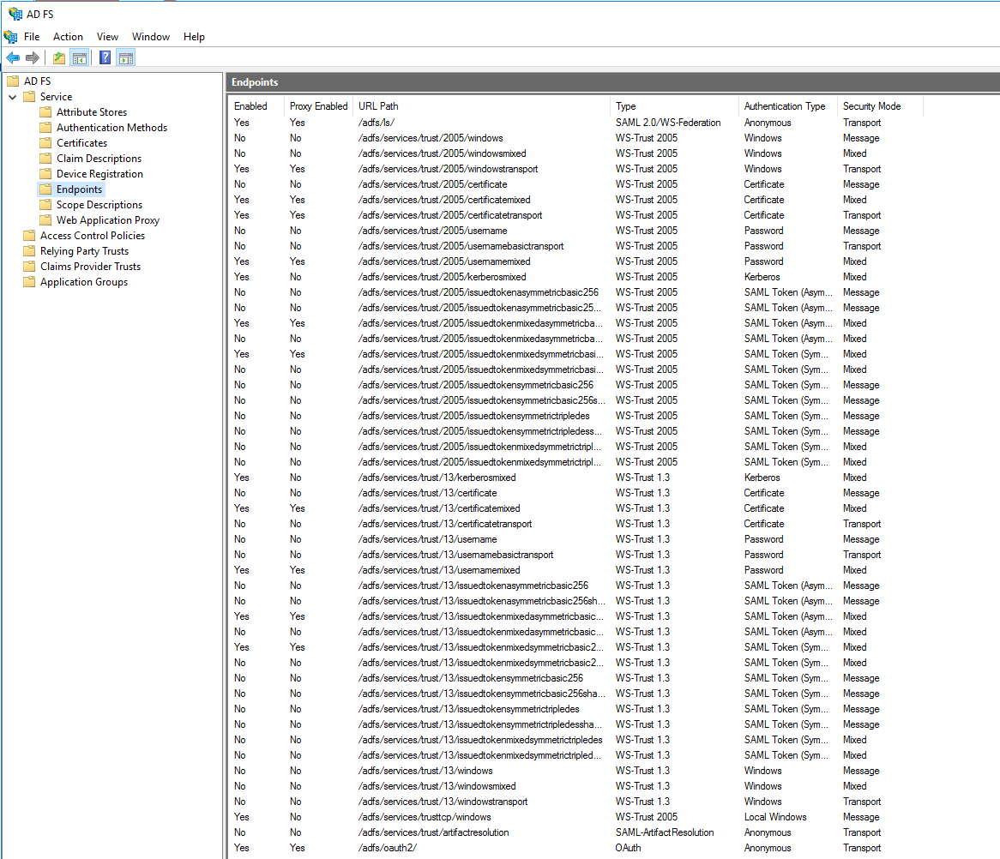

# Relying Party Trust creation

* In AD FS Management, add a Relying Party Trust. (The next steps and values are given as example. Please adapt to your situation)

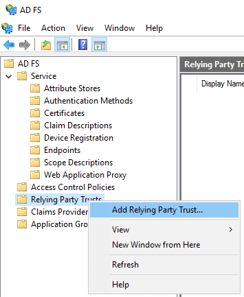

* On the "Welcome" page, choose "Claims aware" and click "Start".

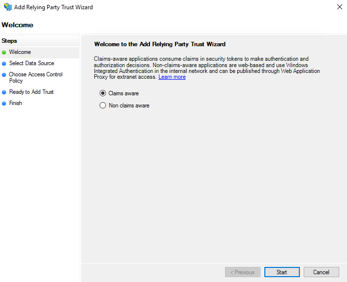

* On the "Select Data Source" page, click "Enter data about the relying party manually", and then click "Next".

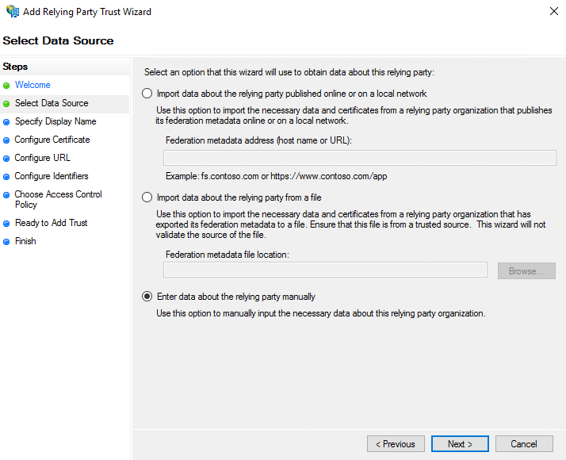

* On the "Specify Display Name" page, type a name in Display name, under Notes type a description for this relying party trust, and then click Next.

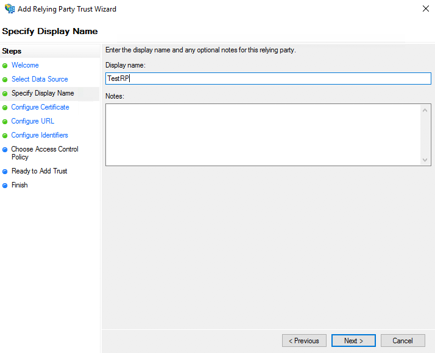

* On the "Configure Certificate" page, click "Next".

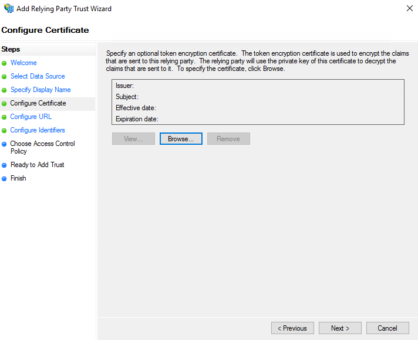

* On the "Configure URL" page, click Next (Do not use SAML or WS)

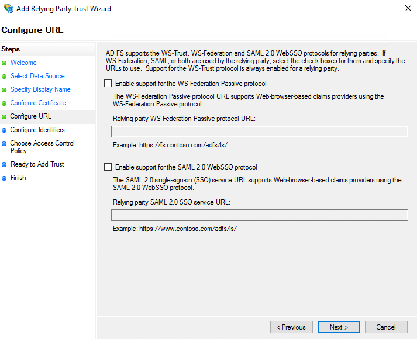

* On the "Configure Identifiers" page, specify an identifier for this relying party, click "Add" to add it to the list, and then click "Next".

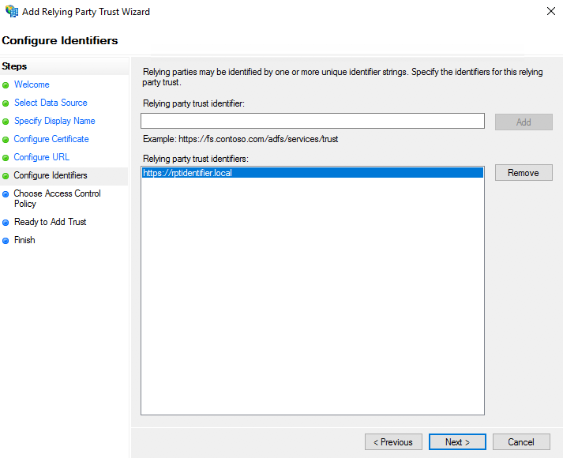

* On the "Choose Access Control Policy" select a policy and click Next. For more information about Access Control Policies, see link:https://docs.microsoft.com/en-us/windows-server/identity/ad-fs/operations/access-control-policies-in-ad-fs[Access Control Policies in AD FS]

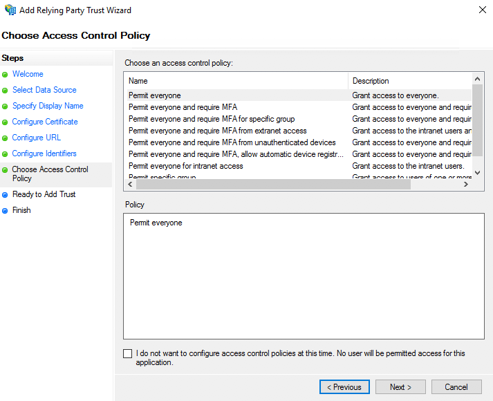

* On the "Ready to Add Trust" page, review the settings, and then click "Next" to save your relying party trust information

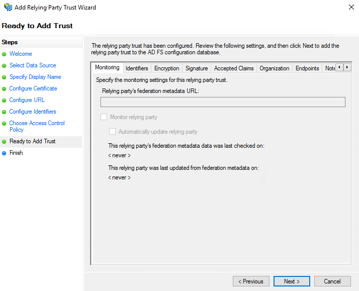

* On the "Finish" page, click "Close". This action automatically displays the "Edit Claim Rules" dialog box

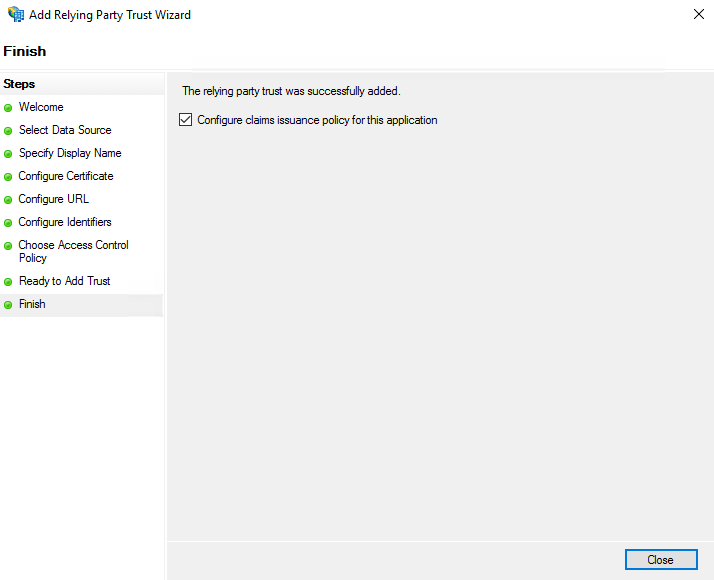

# Claims (Issuance Transform Rules) configuration

* A window "Edit Claim Issuance Policy" must have opened on the previous step.
** Otherwise, right-click the created Relying Party Trust, and then click "Edit Claim Issuance Policy..."

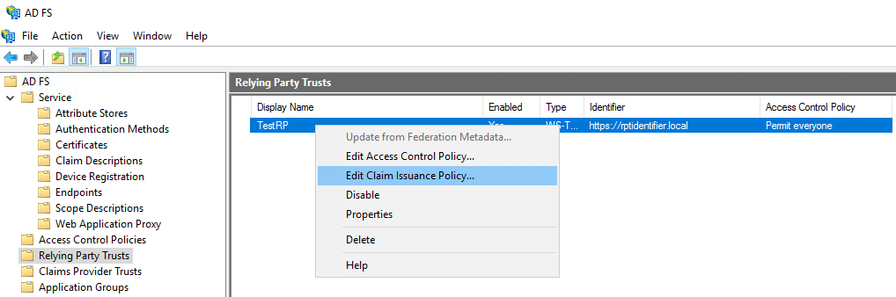

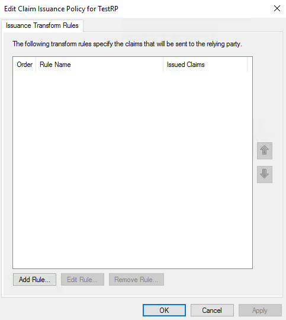

** Create a rule based on the template "Send LDAP Attributes as Claims"

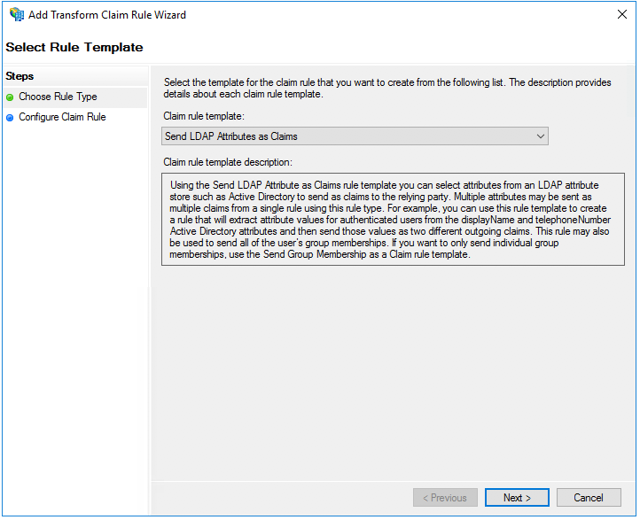

** You can define the data that will be transferred to the Enonic ID Provider.
By default, the ID Provider is expecting the 5 mappings below (the 2 last are not present in the list of possible values but are valid values)

*** Given-Name -> Given-Name
*** Surname -> Surname
*** User-Principal-Name -> UPN
*** objectSid -> objectSid
*** distinguishedName -> dn

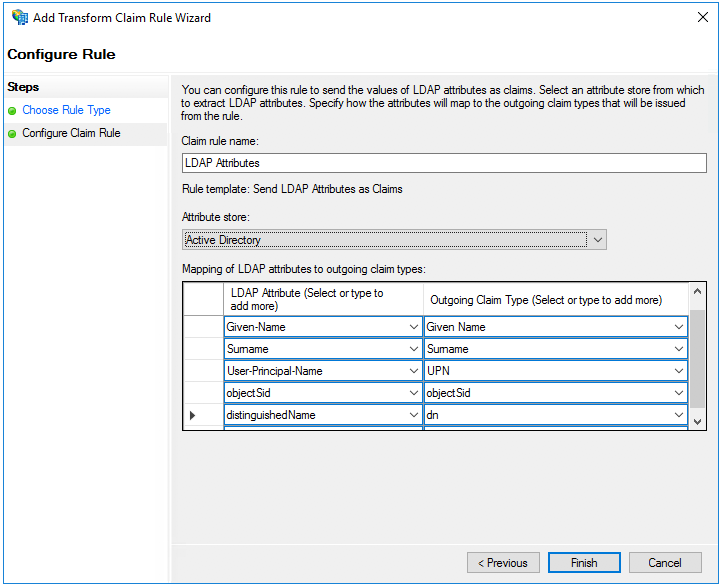

* Using PowerShell, add an AD FS Client

** The redirect URI to specify is "_/idprovider/<userstorename>" appended to your Enonic VHost mapping source (your site URL).

```
Add-AdfsClient -RedirectUri "https://www.example.com/_/idprovider/adfs-userstore" -ClientId "5d51f771-b86a-419e-ad25-27696aafc02b" -Name "MyADFS4Client"
```

* Using PowerShell, grant the AD FS Client permission to the resource
** ClientRoleIdentifier: ClientId used in the command above
** ServerRoleIdentifier: Relying Party Trust identifier

```
Grant-AdfsApplicationPermission -ClientRoleIdentifier "5d51f771-b86a-419e-ad25-27696aafc02b" -ServerRoleIdentifier "https://myadfs4app.local"
```


