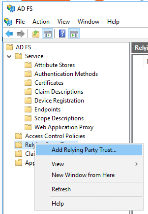
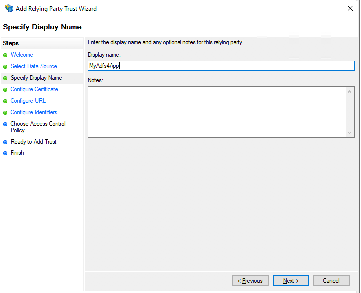
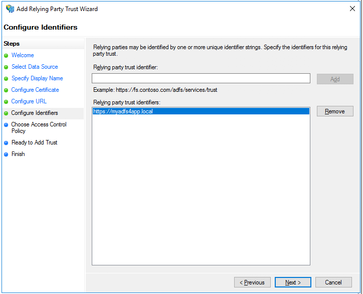
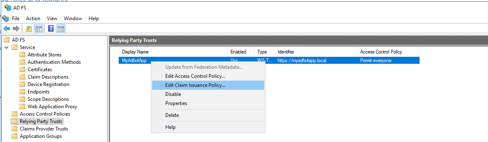

= Relying Party Trust & ADFS client

We suppose here that you already have a server with an Active Directory Federation Services setup.
This example is using AD FS 4 but AD FS 3 is similar and compatible with the ID Provider.


* In AD FS Management, check that the endpoints "/adfs/ls" and "/adfs/oauth2" are enabled

image::images/endpoint_enabled.png[Installation,768,384]

* In AD FS Management, create a Relying Party Trust





* Configure the claims (Issuance Transform Rules)

** A window allowing you to define Issuance Transform Rules must have opened on the creation of the Relying party trust.
Otherwise, select your created Relying Party Trust, and select the option "Edit Claim Issuance Policy..."



** Create a rule based on the template "Send LDAP Attributes as Claims"

image::images/transform2.png[Installation,768]

** You can define the data that will be transferred to the Enonic ID Provider.
By default, the ID Provider is expecting the 5 mappings below (the 2 last are not present in the list of possible values but are valid values)

*** Given-Name -> Given-Name
*** Surname -> Surname
*** User-Principal-Name -> UPN
*** objectSid -> objectSid
*** distinguishedName -> dn

image::images/transform3.png[Installation,768]

* Using PowerShell, add an AD FS Client

** The redirect URI to specify is "_/idprovider/<userstorename>" appended to your Enonic VHost mapping target (your site URL).

```
Add-AdfsClient -RedirectUri "https://www.example.com/_/idprovider/adfs-userstore" -ClientId "5d51f771-b86a-419e-ad25-27696aafc02b" -Name "MyADFS4Client"
```

* Using PowerShell, grant the AD FS Client permission to the resource
** ClientRoleIdentifier is the ClientId user in the command above
** ServerRoleIdentifier is the Relying Party Trust identifier you set when you created your Relying Party Trust.

```
Grant-AdfsApplicationPermission -ClientRoleIdentifier "5d51f771-b86a-419e-ad25-27696aafc02b" -ServerRoleIdentifier "https://myadfs4app.local"
```


