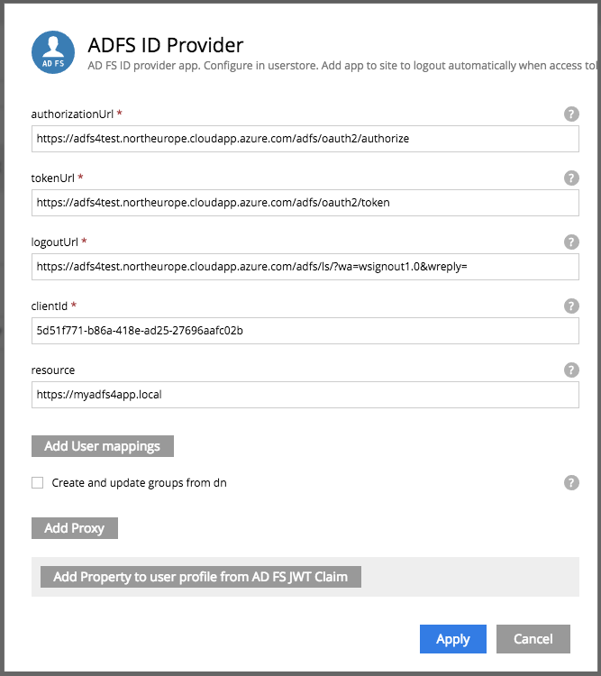

= ADFS ID Provider

Authenticate your users using your Active Directory Federation Services.
This ID Provider uses the OAuth2 endpoint of your ADFS to authenticate users.

== Usage

* On your AD FS server, link:adfs.adoc[setup your Relying Party Trust & AD FS client]
* On Enonic XP
** In the admin tool "Applications", install the application "ADFS ID Provider" .
** In the admin tool "Users", create a user store and configure it to use the ADFS ID Provider.
*** clientId: AD FS Client ID
*** resource: Relying Party Trust identifier

* In your Enonic VHost configuration, modify the approriate mappings so that your site or admin interface uses the user store you created.

    # Use ADFS for a site mysite
    mapping.mysite.host = example.com
    mapping.mysite.source = /
    mapping.mysite.target = /portal/master/mysite
    mapping.mysite.userStore = adfs-userstore

== How to enable debug logging
   
Add the following to $XP_HOME/config/logback.xml and restart the server
   
    <logger name="com.enonic.app.adfsidprovider" additivity="false">
        <level value="DEBUG" />
        <appender-ref ref="STDOUT"/>
        <appender-ref ref="FILE"/>
    </logger>
